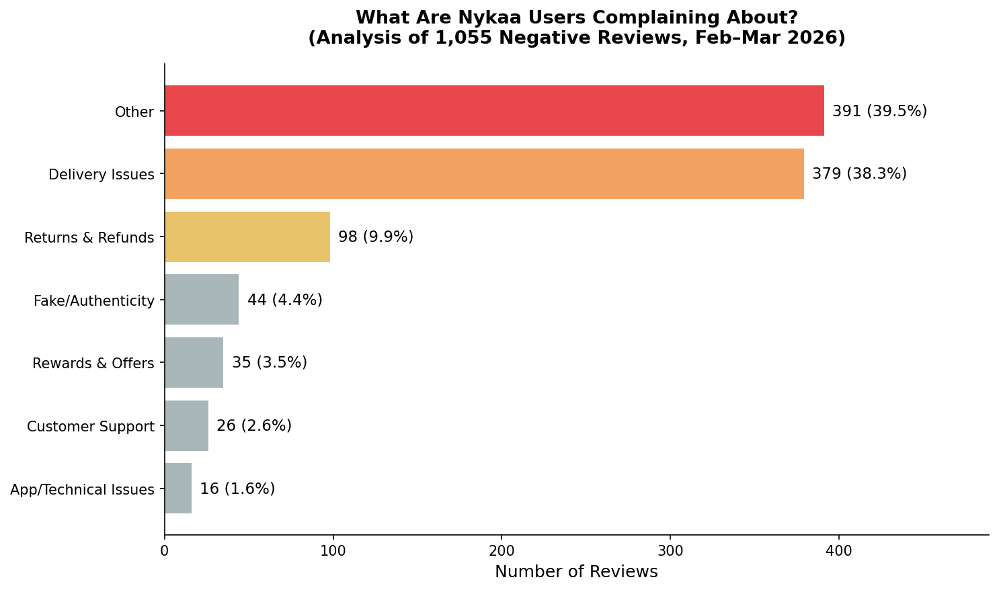
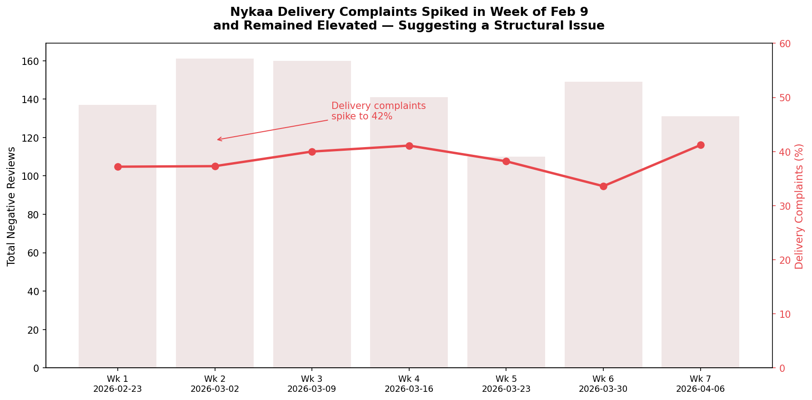
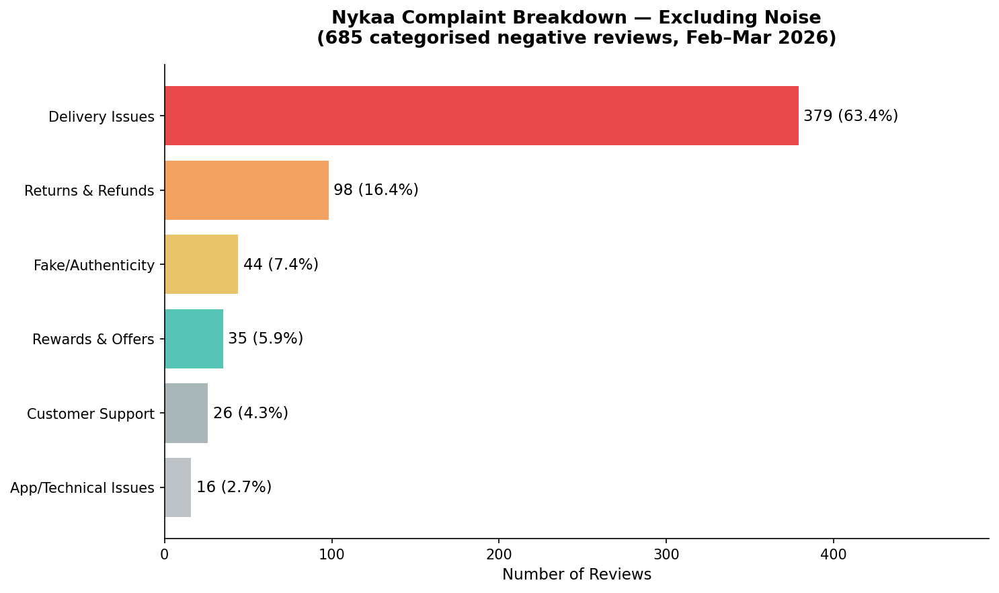
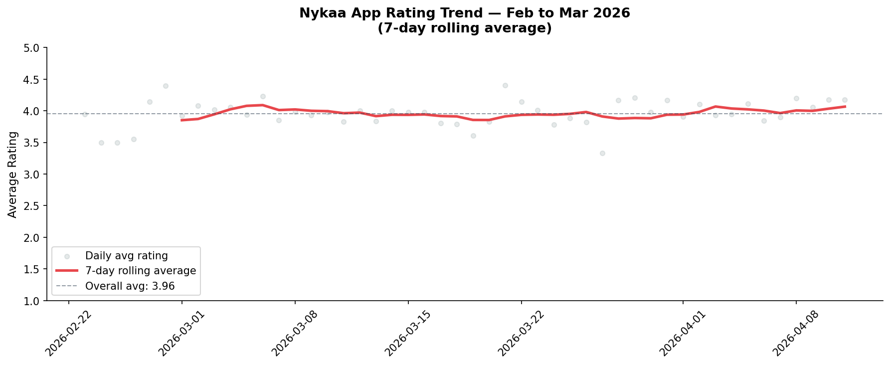

# Nykaa Sentiment Analysis

Analysis of 5,000 Google Play Store reviews for the Nykaa app (Feb–Apr 2026)
to identify the root causes of negative sentiment and surface actionable
product recommendations.

## Overview

- Data source: Google Play Store (via `google-play-scraper`)
- Reviews scraped: 5,000 (Feb 8 – Apr 12, 2026)
- Negative reviews analysed: 1,055
- Overall app rating (period): 3.96 / 5.0

## Key Findings

1. Delivery is the #1 complaint — 379 of 685 categorised negative reviews
   (55.3%) are about delivery failures across all 7 weeks of the analysis period.

2. ETA promises are broken — High-upvote reviews (👍32, 👍8) cite same-day
   delivery shown at checkout but not honoured. Nykaa Now's '60-minute delivery'
   promise was found changing to 'by end of day' after order placement.

3. No delivery partner visibility — 360 out of 379 delivery complaints (95%)
   do not name a specific partner, forcing all escalations to Nykaa's customer
   support. Shadowfax and BlueDart had the most mentions (7 each), followed by
   Delhivery (4) and Xpressbees (2).

## Charts

## How to Run

1. Open `Nykaa_Reviews.ipynb` in Google Colab or Jupyter
2. Run all cells — the first cell installs `google-play-scraper`
3. The notebook will scrape fresh reviews and regenerate all charts

## Dependencies

- `google-play-scraper`
- `pandas`
- `matplotlib`
